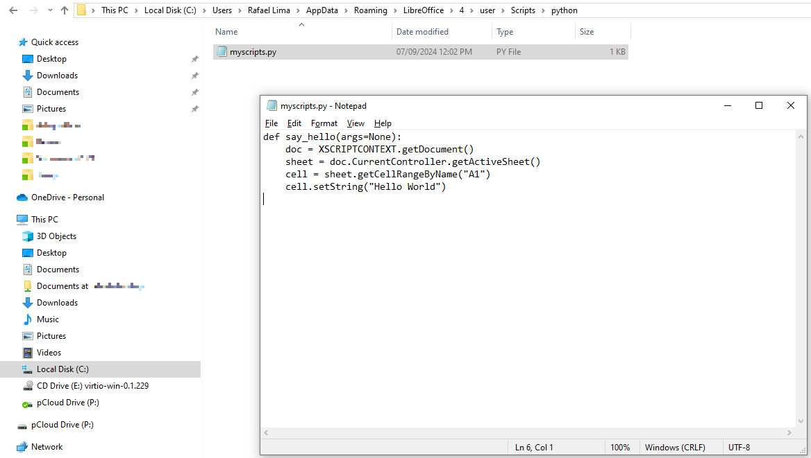
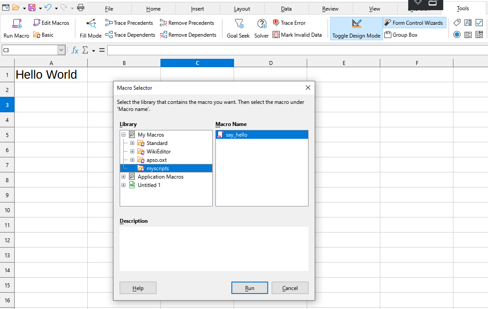
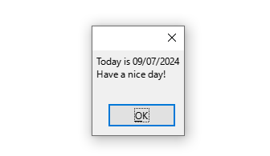
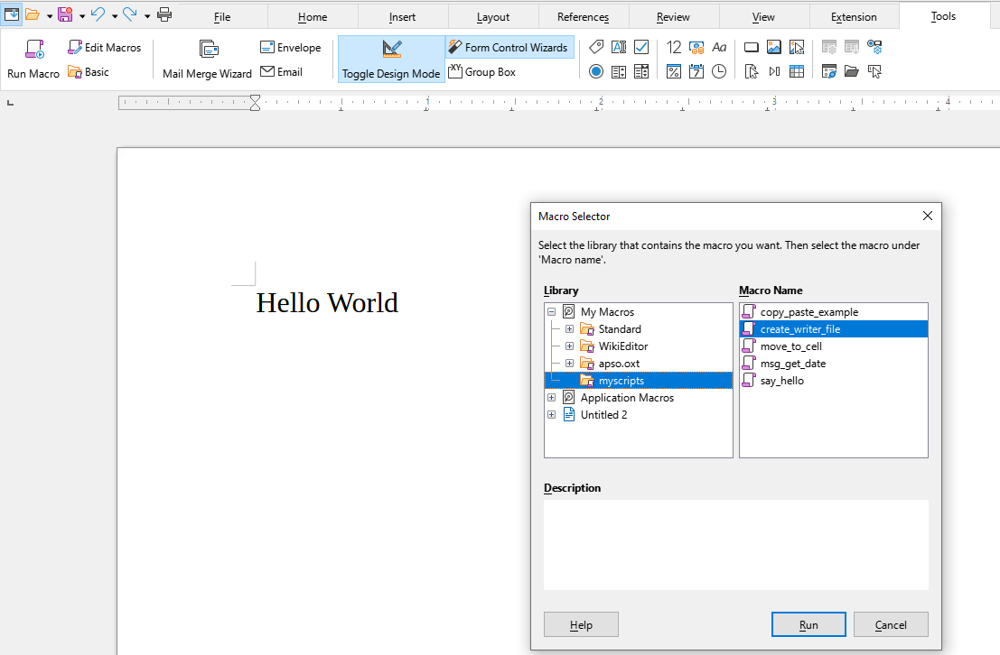

# An Absolute Beginner's Guide to Python Scripting in LibreOffice

## Introduction

If you are just starting with LibreOffice scripting, it is very likely that you heard that scripts can be written in Basic using the built-in Basic IDE, which is a very convenient way to create macros. There's plenty of documentation about it, such as:

- [LibreOffice Basic chapter](https://wiki.documentfoundation.org/Documentation/DevGuide/LibreOffice_Basic) in the LibreOffice Developer's Guide
- [Andrew Pitonyak's book](https://www.pitonyak.org/oo.php) on LibreOffice/OpenOffice macros
- [LibreOffice Basic help pages](https://help.libreoffice.org/latest/en-US/text/sbasic/shared/main0601.html)

And you might have also heard that it is possible to create Python macros as well, which is cool since Python is one of the most popular languages nowadays. However, since there is no built-in Python IDE in LibreOffice, the barrier of entry is a bit taller and learning the absolute basics of Python programming in LibreOffice may scare off new users.

A common question I get from many users is: *How do I create Python scripts in LibreOffice?* The problem with answering this question is that there's not a single answer to it. The answer depends on the type of script you want to create: is it a user a shared or a document script? And it also depends on how you set up your development environment.

So instead of delving into all this complexity, in this guide I would like to provide the basics for those wanting to create their first Python script in LibreOffice. This way, you will have a place to start and build on your Python scripting skills.

### Who is This Guide For?

This guide is meant for those who:

- Already have a good knowledge of Python programming
- Know at least the basics of creating macros in LibreOffice using the Basic language (if not, please check out first the references cited above)
- Have a basic understanding of the Uno API
- Want to get started with Python scripting in LibreOffice, but have no idea where to start

## A Hello World in Python

Now we will create a simple macro that writes "Hello World" to cell `A1` in the currently active Calc sheet. A good way to get started is to imagine how this would be achieved in a Basic macro. Below is a simple implementation that can be easily created and run from the Basic IDE.

```basic
Sub SayHello
    Dim oSheet As Object
    Dim oCell As Object
    oSheet = ThisComponent.CurrentController.getActiveSheet()
    oCell = oSheet.getCellRangeByName("A1")
    oCell.setString("Hello World")
End Sub
```

But why does it help to imagine how the script would be written in Basic if our aim is to create Python scripts. The answer to this question is that the way LibreOffice's Uno API is called is very similar in Basic and Python. So once you figure the minor differences between them, you will be able to convert Basic macros into Python macros.

Without further due, next is the Python script for our Hello World example:

```python
def say_hello(args=None):
    doc = XSCRIPTCONTEXT.getDocument()
    sheet = doc.CurrentController.getActiveSheet()
    cell = sheet.getCellRangeByName("A1")
    cell.setString("Hello World")
```

The main difference in this Python script is the call to `XSCRIPTCONTEXT.getDocument()`, which is equivalent to calling `ThisComponent` in Basic. In Python scripts, `XSCRIPTCONTEXT` is a runtime object that gives access to various scripting features.

The help page [Programming with Python Scripts](https://help.libreoffice.org/latest/en-US/text/sbasic/python/python_programming.html) provides various equivalences between Basic and Python scripts and is a must-read for those wishing to convert their Basic scripts to Python.

### Where are Python Scripts Stored?

Okay, so now that we have the Python script, we need to store it in a place where LibreOffice will be able to find it. In this guide we will be creating so-called *user scripts*, which are scripts that are accessible from any document for the current user.

The first step now is to figure out the folder where such scripts are stored, which depends on your operating system.

On **Windows** user scripts are stored in:

```
%APPDATA%\LibreOffice\4\user\Scripts\python.
```

On **Linux** and **macOS** user scripts are stored in:

```
$HOME/.config/libreoffice/4/user/Scripts/python.
```

If you have never created Python scripts, the folder `Scripts/python` will not exist. So the first step is to create this folder. On **Windows** open the **File Explorer** and type `%APPDATA%` in the address bar. Now navigate to the `\LibreOffice\4\user\` folder. Inside this folder create the `Scripts` folder. Now enter the `Scripts` folder and create the `python` folder. This is where our user Python scripts will be stored. Note that folder names are case-sensitive.

Now we can finally create our Python script files. Inside the folder we've just created, create a new file named `myscripts.py` (it could be any name) and copy our Python script to this file and save it.



Here I am using Notepad to edit the script, but you can use any IDE of your preference.

Now you can finally run our macro. Open LibreOffice Calc and go to *Tools - Macros - Run Macro*. Choose the module `myscripts` under `My Macros` and then select the script `say_hello`. Click *Run* and see the "Hello World" message written to cell "A1".



Congratulations! You have created your first Python macro using LibreOffice. Now the sky is the limit!

## A More Complex Example

Before wrapping up this tutorial, I will show a few more simple examples that will help you create more advanced Python scripts.

### Scripts with Uno Commands

Uno commands can be called from scripts (both in Basic and Python) and are very helpful to automate simple tasks. For instance, let's create a simple Calc script that copies cell "A1" and pastes it into cell "C1". In Basic the script would look like this:

```basic
Sub MoveToCell(oDispatcher As Object, oFrame As Object, sDestCell As String)
    Dim args(0) As New com.sun.star.beans.PropertyValue
    args(0).Name = "ToPoint"
    args(0).Value = sDestCell
    oDispatcher.executeDispatch(oFrame, ".uno:GoToCell", "", 0, args)
End Sub

Sub CopyPaste
    Dim oDispatcher As Object
    Dim oFrame As Object
    oFrame = ThisComponent.CurrentController.Frame
    oDispatcher = createUnoService("com.sun.star.frame.DispatchHelper")
    ' Move to cell A1
    MoveToCell(oDispatcher, oFrame, "A1")
    ' Copy contents
    oDispatcher.executeDispatch(oFrame, ".uno:Copy", "", 0, Array())
    ' Move to cell C1
    MoveToCell(oDispatcher, oFrame, "C1")
    ' Paste contents
    oDispatcher.executeDispatch(oFrame, ".uno:Paste", "", 0, Array())
End Sub
```

The same result can be achieved in Python with:

```python
import uno
from com.sun.star.beans import PropertyValue

def move_to_cell(dispatcher, frame, cell_address):
    # Note that we must pass a list of arguments, even if it is just one
    args = [PropertyValue(Name="ToPoint", Value=cell_address)]
    dispatcher.executeDispatch(frame, ".uno:GoToCell", "", 0, args)

def copy_paste_example(args=None):
    doc = XSCRIPTCONTEXT.getDocument()
    frame = doc.CurrentController.Frame
    # Code needed to create Uno services
    ctx = uno.getComponentContext()
    smgr = ctx.getServiceManager()
    dispatcher = smgr.createInstanceWithContext("com.sun.star.frame.DispatchHelper", ctx)
    # Move to cell A1
    move_to_cell(dispatcher, frame, "A1")
    # Copy contents
    dispatcher.executeDispatch(frame, ".uno:Copy", "", 0, [])
    # Move to cell C1
    move_to_cell(dispatcher, frame, "C1")
    # Paste contents
    dispatcher.executeDispatch(frame, ".uno:Paste", "", 0, [])
```

This script can be copied to the `myscripts.py` file we created in the previous example. Now run the `copy_paste_example` macro to see the results.

The interesting aspect of this example is how similar the Basic and Python versions of the scripts are. If you know how to do something in Basic, you will soon be able to convert it into a Python script.

The two main differences here are:

- The import of the `uno` library to provide access to the `getComponentContext` method, which is used to get the service manager, which in turn allows to create Uno services.
- The creation of `PropertyValue` instances, which are used whenever a Uno command needs arguments. Note how much easier it is to create `PropertyValue` instances in Python.

For a list of all Uno commands, read the [Dispatch Commands](https://wiki.documentfoundation.org/Development/DispatchCommands) wiki page.

## The ScriptForge Library

LibreOffice ships with the ScriptForge library, which simplifies various aspects of the API and can be used both in Basic and Python scripts. Specifically for Python scripts, the ScriptForge library provides the `Basic` service, which enables calling various Basic methods from within a Python script.

### Showing a Message Box

For instance, suppose you would like to call `MsgBox` from within a Python macro. This can be achieved with the following script:

```python
from datetime import datetime
from scriptforge import CreateScriptService

def msg_get_date(args=None):
    # Create the Basic service from ScriptForge
    bas = CreateScriptService("Basic")
    # Shows a MsgBox with the current date
    today_str = datetime.today().strftime("%d/%m/%Y")
    bas.MsgBox(f"Today is {today_str}\nHave a nice day!")
```



In this example we import the `CreateScriptService` from the `scriptforge` library, which can be used to instantiate ScriptForge services (in this case, the Basic service).

### Creating Documents

Next is another simple example using ScriptForge to create a blank Writer file and insert some text in it.

```python
def create_writer_file(args=None):
    ui = CreateScriptService("UI")
    sf_doc = ui.CreateDocument("Writer")
    doc = sf_doc.XComponent
    doc.Text.setString("Hello World")
```



Here we use the UI service from ScriptForge to create the Writer document. Then we access its component to insert some text into the document.

### Learning More

You can learn more about ScriptForge and its services in the following [help page](https://help.libreoffice.org/latest/en-US/text/sbasic/shared/03/lib_ScriptForge.html).

### Source Code

Click [here](../Media/ch01_Tutorial.py) to download the Python file containing all examples developed in this guide.

## What's Next?

This introductory chapter aimed at providing you with the basics of Python scripting, so that you can have a starting point to start creating your own scripts and exploring the LibreOffice API.

In the upcoming chapters we will discuss more advanced aspects of LibreOffice Python scripting, such as the creation of shared and document scripts. We will also discuss how to run scripts from a separate process via pipes, as well as supporting tools to debug your code.